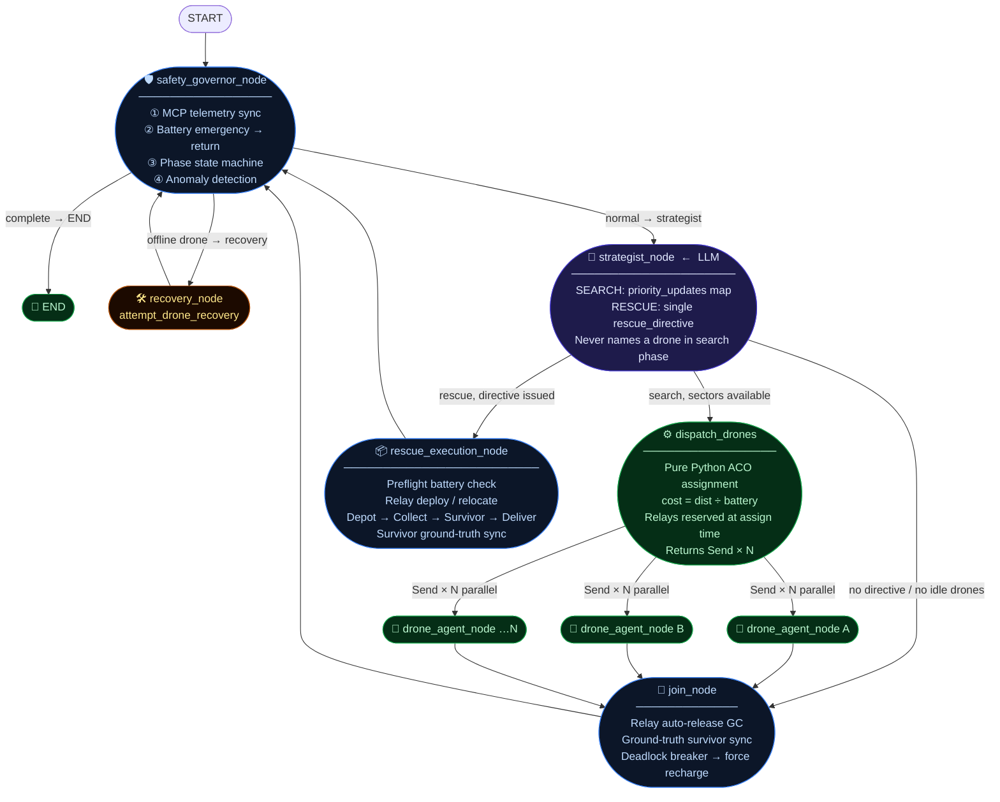
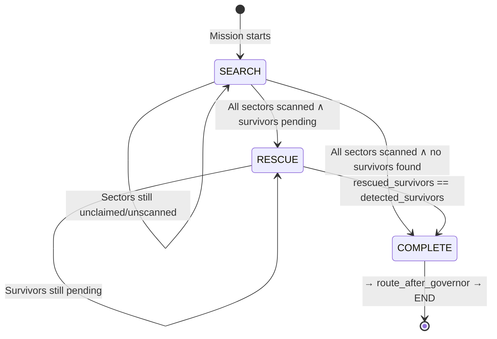

# 🔥 SIREN: Swarm Intelligence Rescue & Engagement Network

> **A fully autonomous, decentralized, pheromone-guided drone swarm for disaster zone Search & Rescue — powered by LangGraph, Ant Colony Optimization, and a real-time MCP hardware simulation.**

---

## System Overview

SIREN is a **multi-agent AI system** that autonomously deploys a drone swarm across a disaster grid, discovers survivors using thermal imaging, and coordinates relay-assisted supply deliveries — all without a human in the loop.

The architecture is built on three pillars:

| Pillar | Technology | Role |
|---|---|---|
| 🧠 **AI Strategist** | LLM (Gemini Flash, Structured Output) | Shapes the environment via pheromone signals. Never commands drones. |
| ⚙️ **Autonomous Drones** | Pure Python + LangGraph `Send` | Read signals, self-assign sectors, execute missions in parallel. |
| 🔌 **Hardware Layer** | MCP (Model Context Protocol) | Physics simulation: battery, movement, scanning, supply chain. |

---

## High-Level Architecture

```
┌─────────────────────────────────────────────────────────────────────┐
│                       SIREN Control Stack                           │
│                                                                     │
│   ┌─────────────┐   SSE Stream    ┌──────────────────────────────┐  │
│   │  Browser UI │◄────────────────│   FastAPI / MissionRunner    │  │
│   │  (Live Map) │                 │   asyncio Task per Mission   │  │
│   └─────────────┘   REST API      └──────────┬───────────────────┘  │
│                                              │                      │
│                                    ┌─────────▼──────────┐          │
│                                    │   LangGraph Graph  │          │
│                                    │   (SwarmState)     │          │
│                                    └─────────┬──────────┘          │
│                                              │                      │
│                          ┌───────────────────▼──────────────────┐   │
│                          │        MCP stdio Transport           │   │
│                          │  (JSON-RPC, per-request multiplexed) │   │
│                          └───────────────────┬──────────────────┘   │
│                                              │                      │
│                                    ┌─────────▼──────────┐          │
│                                    │   MCP Server       │          │
│                                    │   (World Simulation│          │
│                                    │    Drone Physics)  │          │
│                                    └────────────────────┘          │
└─────────────────────────────────────────────────────────────────────┘
```

---

## LangGraph Topology

SIREN uses a **cyclic agentic graph** with conditional routing, not a linear chain. Every node returns state diffs; LangGraph merges them via typed reducers.



---

## ACO Pheromone Search Engine

The search phase is a real-time **Ant Colony Optimization** simulation.

```
┌──────────────────────────────────────────────────────────┐
│             SECTOR PHEROMONE MAP (the blackboard)        │
│                                                          │
│  sector_1: priority=10.0  UNCLAIMED     ◄── strong signal│
│  sector_3: priority=3.0   UNCLAIMED                      │
│  sector_5: priority=9.0   CLAIMED→ALPHA ◄── drone in fly │
│  sector_6: priority=6.0   UNCLAIMED                      │
│  sector_7: priority=9.0   CLAIMED→DELTA                  │
│  sector_2: priority=0.0   SCANNED  ✓   ◄── permanent lock│
│                                                          │
│  Strategist writes priorities. Drones read and self-assign│
└──────────────────────────────────────────────────────────┘
```

### Greedy Assignment Algorithm

```python
# 1. Sort sectors by pheromone strength (strongest first)
available_sectors.sort(key=lambda s: s.priority, reverse=True)

# 2. For each sector, find the cheapest drone
cost = distance_to_sector / battery_level   # lower = better

# 3. If sector > 10 cells from base, reserve a relay drone too
if dist(base, sector) > 10:
    relay = cheapest_eligible_idle_drone  # lowest battery heuristic

# 4. Fan-out with LangGraph Send (true parallel async)
return [Send("drone_agent_node", {drone_id, target_sector, ...})]
```

---

## Relay Mesh Network

When a target is > 10 cells from the base station, a relay drone is deployed at the optimal midpoint to bridge the signal gap.

```
BASE (0,0)          RELAY (mid_x, mid_y)          TARGET (tx, ty)
    ●━━━━━━━━━━━━━━━━━━━━━━◆━━━━━━━━━━━━━━━━━━━━━━━●
    │◄──── ≤ 10 cells ────►│◄──── ≤ 10 cells ─────►│
    │    signal OK         │      signal OK         │
    
    Relay midpoint = ( (base_x + far_dest_x) / 2,
                       (base_y + far_dest_y) / 2 )
    
    far_dest = whichever is further from base: depot OR survivor
```

### Relay Lifecycle

```
                   ┌──────────────┐
                   │   Deployed   │  unlock → move_to(mid) → lock_drone
                   └──────┬───────┘   active_relays["ALPHA"] = "ECHO"
                          │
                   ┌──────▼───────┐
     new mission → │  Relocated   │  unlock → move_to(new_mid) → lock_drone
                   └──────┬───────┘   step_sync() ← broadcasts to frontend
                          │
                   ┌──────▼───────┐
    main drone     │ Auto-Released│  unlock_drone("ECHO")
    ≤10 from base →│   Freed      │  active_relays["ALPHA"] = None ← sentinel
                   └──────────────┘      └► reducer pops key permanently
```

### Sentinel Deletion Pattern (LangGraph)

```python
# ❌ WRONG — reducer merges old state back in (key survives!)
updates["active_relays"] = {}  # old {"ALPHA": "ECHO"} merged right back

# ✅ CORRECT — None is a sentinel: reducer calls merged.pop("ALPHA")
updates["active_relays"] = {"DRONE_ALPHA": None}
```

```python
def _merge_active_relays(old, new):
    merged = {**old}
    for k, v in new.items():
        if v is None:
            merged.pop(k, None)  # ← permanent deletion
        else:
            merged[k] = v
    return merged
```

---

## SwarmState — The Digital Blackboard

All agent nodes read from and write diffs to `SwarmState`. LangGraph merges updates from parallel nodes using custom typed reducers.

```
┌───────────────────────────────────────────────────────────┐
│                       SwarmState                          │
├──────────────────┬────────────────────────────────────────┤
│ drones           │ [Annotated] _merge_drones              │
│                  │ Latest telemetry per drone ID wins     │
├──────────────────┼────────────────────────────────────────┤
│ mission_log      │ [Annotated] _merge_mission_log         │
│                  │ Append-only across parallel nodes      │
├──────────────────┼────────────────────────────────────────┤
│ search_grid      │ [Annotated] _merge_search_grid         │
│                  │ scanned=True is PERMANENT, never unset │
├──────────────────┼────────────────────────────────────────┤
│ active_relays    │ [Annotated] _merge_active_relays       │
│                  │ None sentinel for key deletion         │
├──────────────────┼────────────────────────────────────────┤
│ signal_map       │ [Annotated] _merge_signal_map          │
│                  │ Dict merge, each drone writes own key  │
├──────────────────┼────────────────────────────────────────┤
│ phase            │ str: "search" | "rescue" | "complete"  │
│ rescue_directive │ Optional[{drone, survivor, supply}]    │
│ detected_survivors│ List — authoritative from MCP only   │
│ rescued_survivors │ List — authoritative from MCP only   │
└──────────────────┴────────────────────────────────────────┘
```

**Who writes what:**

| Writer | Fields |
|---|---|
| `strategist_node` (LLM) | `search_grid[*].priority`, `rescue_directive`, `mission_log` |
| `drone_agent_node` (Python) | `search_grid[*].claimed_by/scanned`, `drones`, `active_relays`, `signal_map`, `mission_log` |
| `safety_governor_node` | `drones`, `phase`, `mission_log` |
| `join_node` | `active_relays`, `detected_survivors`, `rescued_survivors`, `mission_log` |
| `rescue_execution_node` | `rescue_directive` (clear), `detected_survivors`, `rescued_survivors`, `mission_log` |

---

## Phase State Machine



---

## Frontend Real-Time Sync Pipeline

```
  drone_agent_node                 mission_runner.py              Browser UI
       │                               │                              │
       │  await mcp_client.step_sync() │                              │
       ├──────────────────────────────►│                              │
       │                               │ get_world_state (MCP)        │
       │                               ├────────────────►             │
       │                               │◄────────────────             │
       │                               │ _sync_local_world()          │
       │                               │ _broadcast({type:world_sync})│
       │                               ├──────────────────────────────►
       │ (sleeps 0.5s for animation)   │                              │ re-fetch /world_state
       │◄──────────────────────────────│                              │ animate drone position
       │                               │                              │
       │          (background)         │                              │
       │          _world_state_poller  │                              │
       │          every 3.0s           ├──────────────────────────────►
       │          safety net during    │                              │ smooth refresh
       │          long LLM calls       │                              │
```

Every physical action (`move_to`, `thermal_scan`, `collect_supplies`, `deliver_supplies`, relay `unlock/move/lock`) is followed by `step_sync()`. This means the frontend sees **each individual action** as it happens, not as a teleporting batch.

---

## MCP Tool Catalogue

The MCP server exposes 24 tools across 7 categories:

| Category | Tools |
|---|---|
| 🔍 Discovery | `discover_drones`, `get_all_drone_statuses`, `assign_sector` |
| 🔒 Control | `lock_drone`, `unlock_drone` |
| ✈️ Movement | `move_to`, `get_grid_map` |
| 🌡️ Scanning | `thermal_scan`, `acoustic_scan` |
| 🔋 Battery | `get_battery_status`, `return_to_charging_station`, `charge_drone` |
| 📦 Supplies | `list_supply_depots`, `collect_supplies`, `deliver_supplies` |
| 📡 Status | `get_drone_status`, `get_swarm_summary`, `get_mission_log`, `get_world_state` |
| 🔗 Mesh | `broadcast_mesh_message`, `attempt_drone_recovery`, `get_mesh_log` |

---

## Key Design Decisions & Why

| Decision | Rationale |
|---|---|
| **LLM writes pheromones, not move commands** | Prevents LLM from micro-managing, hallucinating drone names, or breaking relay meshes. The LLM stays at the "what matters" level. |
| **Pure Python drone_agent_node (no LLM)** | Speed + determinism. Each drone node executes ~8 MCP calls in sequence. No token budget wasted on mechanical steps. |
| **LangGraph `Send` for fan-out** | True asyncio parallelism. All N drones operate concurrently within a single LangGraph tick. |
| **`_TEMP_LOCKED_RELAYS` module set** | Prevents two concurrent async drone nodes from racing to lock the same relay in the same parallel tick (a data race that state reducers alone cannot prevent). |
| **Relay threshold: 10 cells from BASE** | Signal attenuation starts from the base station, not from the drone. The relay must bridge the gap from home, not from the drone's current position. |
| **`None` sentinel for relay deletion** | LangGraph reducer pattern — you cannot remove a dict key by omitting it, because `{**old, **new}` would restore it. `None` is the explicit delete tombstone. |
| **`step_sync()` after every MCP action** | Ensures smooth frontend animation. Without it, all position updates from a node arrive simultaneously (teleport effect). |
| **join_node as relay GC** | Defense-in-depth. Even if `drone_agent_node` crashes mid-execution and skips its auto-release step, `join_node` catches the leaked locked relay next tick. |
| **Deadlock breaker in join_node** | If all feasible drones are stuck at 50% battery — not enough for any mission but not low enough for the battery emergency — the system would loop forever. The breaker forces recharge when zero rescue directives succeed. |
| **Battery preflight in rescue_execution_node** | Fails fast with a clear log before any MCP action. Prevents drones from flying to the depot, picking up supplies, and then discovering they can't reach the survivor. |
