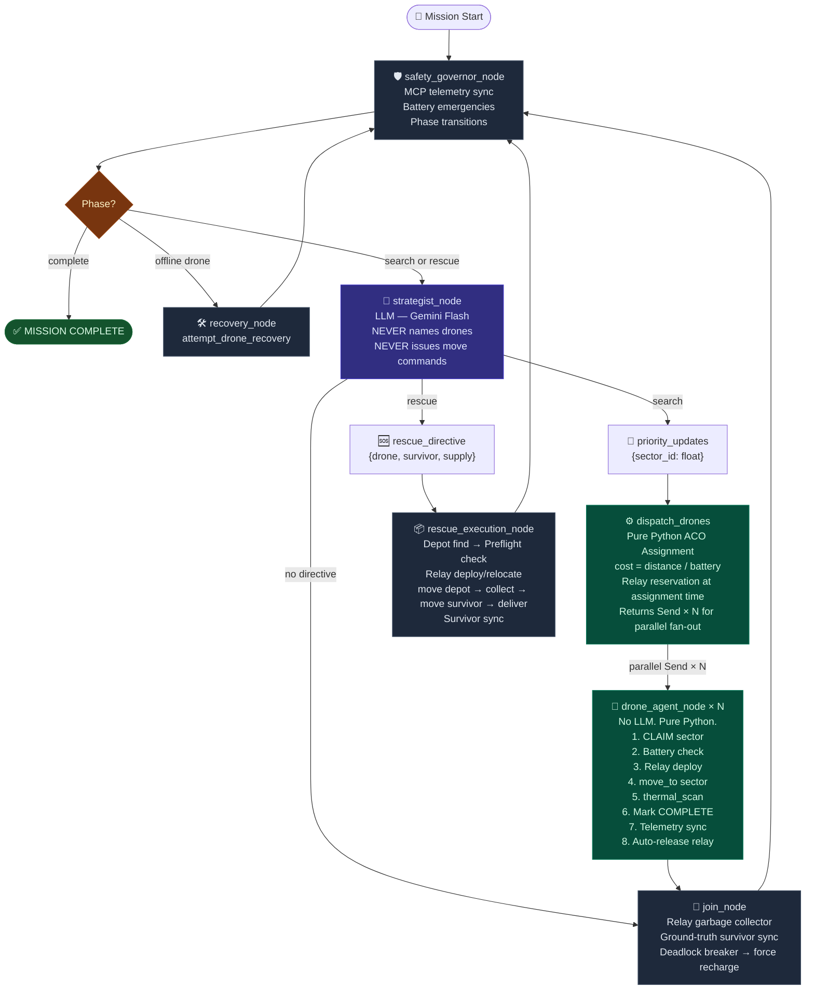

# SIREN Swarm Controller — Drone Decision & Automation Logic

This document explains how the **SIREN True Swarm Intelligence** system makes decisions, deploys relays, and transitions mission phases.

The system uses a **strict separation of concerns** between two layers:

| Layer | Component | Role |
|---|---|---|
| 🧠 **Environment Intelligence** | `strategist_node` (LLM) | Shapes the pheromone map. Never commands drones directly. |
| ⚙️ **Local Autonomy** | `drone_agent_node` (Pure Python) | Reads pheromones, claims sectors, moves, scans, deploys relays. No LLM. |

> The LLM does **not** issue `move_to` commands. It writes **priority signals** to a shared grid.  
> The drones **read** those signals and **self-assign** sectors using local Pythagorean cost calculations.

---

## 1. Pheromone-Guided Sector Assignment (ACO Pattern)

The SIREN search operates like an **Ant Colony Optimization** system:

### Strategist (Environment Writer)
- Every cycle, the LLM Strategist reads the current swarm positions, scan progress, and survivor detections.
- It outputs a `priority_updates` map: `{sector_id → float (0.0–10.0)}`.
- Higher priority = stronger "pheromone" = drones will naturally swarm toward that sector.
- **Hard rule**: The Strategist can NEVER boost an already-scanned sector (permanent lock at 0.0).
- It never names a drone. It never issues a move command.

### Dispatch (Pure Python — Greedy ACO Assignment)
The `dispatch_drones` function runs immediately after the Strategist writes pheromones:

1. Collects all **unclaimed, unscanned** sectors with `priority > 0`.
2. Sorts them **descending** by priority (strongest pheromone gets assigned first).
3. For each sector, finds the **cheapest eligible idle drone** using the cost metric:
   ```
   cost = distance_to_sector / battery_level
   ```
   — A full battery drone close to the target wins. A depleted drone far away gets a huge cost penalty.
4. **Relay Check at Assignment Time**: If `distance(sector_coords, base_station) > 10`, the algorithm also reserves a second idle drone as a relay. If no relay is available, the sector is **skipped with a log** (the Strategist sees this and adapts next cycle).
5. The function returns a `list[Send]` — LangGraph uses this to **fan out all drone assignments in true parallel** via async sub-tasks.

### Drone Agent (Local Executor — No LLM)
Each `drone_agent_node` receives its `drone_id` + `target_sector` and executes an 8-step pipeline:

```
CLAIM → BATTERY CHECK → RELAY DEPLOY → MOVE → SCAN → COMPLETE → TELEMETRY SYNC → AUTO-RELEASE
```

No LLM is involved at any step. All logic is pure Python.

---

## 2. Relay Mesh Network Deployment

Relays are required when a destination is **> 10 cells from the base station at (0,0)**.  
This is checked against the **base station**, not the drone's current position.

### Deployment Algorithm (`drone_agent_node` + `rescue_execution_node`)

1. **Threshold Check**: `get_distance(base_x, base_y, target_x, target_y) > 10`
2. **Midpoint Calculation**:
   - For search: midpoint between base and target sector.
   - For rescue: midpoint between base and the **furthest leg** of the trip (depot or survivor, whichever is farther from base).
   ```python
   mid_x = int((base_x + far_dest_x) / 2)
   mid_y = int((base_y + far_dest_y) / 2)
   ```
3. **Relay Candidate Selection** — from all non-assigned idle drones:
   - Must NOT be the main drone.
   - Must NOT already be acting as a relay (`active_relays.values()`).
   - Must NOT be locked, offline, charging, or carrying a payload.
   - Must have enough battery to reach the midpoint + 25% reserve.
   - **Lowest battery heuristic**: The eligible drone with the *lowest* battery is chosen. This deliberately uses near-depleted drones for the stationary relay job, preserving high-battery drones for primary missions.
4. **Lock & Record**:
   - `move_to(relay, mid_x, mid_y)` — fly it to position.
   - `lock_drone(relay)` — prevent it from being stolen by other agents.
   - `active_relays[drone_id] = relay_id` — record the mapping.

### Relay Relocation

When the same drone undertakes a different mission later, its relay may need to reposition.
The system **unlocks, moves, then re-locks** the relay:

```python
await unlock_drone(existing_relay)       # 1. Temporarily allow movement
await move_to(existing_relay, new_mid)   # 2. Fly to new optimal midpoint
await lock_drone(existing_relay)         # 3. Lock again immediately
await step_sync()                        # 4. Broadcast new position to frontend
```

> ⚠️ **Why unlock first?** The MCP server blocks `move_to` on locked drones. Forgetting the unlock causes the relay to silently stay in place while the node logs "Relocated" — a phantom success.

### Relay Auto-Release

A relay is no longer needed once the main drone returns within 10 cells of the base station. Auto-release happens in two places (defense-in-depth):

1. **`drone_agent_node` Step 8**: If the mission's target sector is ≤ 10 cells from base, auto-release fires upon completing the sector.
2. **`join_node` (Garbage Collector)**: After every parallel wave, scans `active_relays` for any main drone that is now ≤ 10 cells from base and unlocks the corresponding relay.

#### The Sentinel Deletion Pattern

Because LangGraph merges state updates with a **reducer** (`_merge_active_relays`), you cannot remove a key by omitting it — the old value will be merged right back!

Instead, we use `None` as a **sentinel deletion value**:

```python
# WRONG — old reducer will merge {"ALPHA": "ECHO"} back in
updates["active_relays"] = {}

# CORRECT — tells the reducer to pop the key
updates["active_relays"] = {"DRONE_ALPHA": None}
```

The reducer checks for `None` and calls `merged.pop(key)`, making the deletion permanent across all parallel state updates.

---

## 3. Phase State Machine (Safety Governor)

The `safety_governor_node` runs **every cycle** before the Strategist and enforces:

```
SEARCH ──(all sectors scanned, survivors found)──► RESCUE ──(all rescued)──► COMPLETE
       ──(all sectors scanned, no survivors)──────────────────────────────► COMPLETE
```

It also handles:
- **MCP Ground-Truth Sync**: Pulls fresh telemetry from `get_all_drone_statuses` to override stale LangGraph state.
- **Battery Emergency**: If a drone's battery is below `BATTERY_LOW_THRESHOLD` and it is idle/flying (not locked as relay), the governor immediately commands `return_to_charging_station`.
- **Anomaly Detection**: If any drone reports `status=offline`, the governor routes to `recovery_node`.

---

## 4. Rescue Phase Execution

The Strategist issues **one** `rescue_directive` per cycle:
```json
{"drone_id": "DRONE_ALPHA", "survivor_id": "S1", "supply_type": "medical_kit"}
```

The `rescue_execution_node` then executes the entire supply chain autonomously:

1. **Depot Discovery**: Calls `list_supply_depots` to find the nearest depot stocking the required supply.
2. **Battery Preflight**: Calculates `dist(drone→depot) + dist(depot→survivor)`. If insufficient battery, drops the directive cleanly with a detailed log — the Strategist sees the failure and reassigns next cycle.
3. **Relay Deploy**: If any leg of the trip is > 10 cells from base, deploys or relocates a relay to the optimal midpoint.
4. **Supply Chain**: `move_to(depot)` → `collect_supplies` → `move_to(survivor)` → `deliver_supplies`.
5. **Ground-Truth Sync**: Calls `get_swarm_summary` to get the authoritative rescued/pending list from the MCP server.
6. **Directive Clear**: Sets `rescue_directive = None` so the Strategist issues a fresh one next cycle.

### Deadlock Breaker (join_node)

If the Strategist issues no directive (all drones are `FAIL` on battery), the `join_node` detects the deadlock and forces all idle, unlocked drones with `battery < 95%` to return to the charging station. This breaks the loop by ensuring at least one drone is charging and will be `FEASIBLE` on the next cycle.

---

## 5. Frontend Real-Time Sync

Every MCP tool call that physically changes world state is followed by:

```python
await mcp_client.step_sync()
```

This triggers a callback wired by `mission_runner.py` that:
1. Calls `get_world_state` on the MCP server.
2. Updates the local `WorldState` singleton (used by the REST dashboard).
3. Emits a `world_sync` SSE event to all connected browser clients.
4. Sleeps `0.5s` so the frontend animation finishes before the next action fires.

A `_world_state_poller` background task also runs every 3 seconds as a safety net for long LLM calls that contain no MCP actions.

---

## 6. LangGraph Concurrency Architecture

### Annotated Reducers
All fields touched by parallel `drone_agent_node` executions use typed reducer functions:

| Field | Reducer | Strategy |
|---|---|---|
| `drones` | `_merge_drones` | Latest telemetry per drone ID wins |
| `mission_log` | `_merge_mission_log` | Append-only |
| `search_grid` | `_merge_search_grid` | `scanned=True` is permanent and can never be unset |
| `active_relays` | `_merge_active_relays` | `None` sentinel for deletions |
| `signal_map` | `_merge_signal_map` | Dict merge (each drone writes its own key) |

### Parallel Fan-Out (Send API)
```python
sends = [Send("drone_agent_node", {**state, "drone_id": d, "target_sector": s}) for d, s in assignments.items()]
return sends  # LangGraph executes all drone_agent_nodes concurrently
```

`_TEMP_LOCKED_RELAYS` (a module-level Python `set`) prevents two concurrent `drone_agent_node` coroutines from locking the same relay drone in the same tick.

---

## 7. Decision Flow (Current Architecture)

