# AETHER Swarm Commander — Drone Decision & Automation Logic

This document outlines how the LangGraph swarm controller and the underlying Python execution environment make decisions regarding drone allocation, relay deployment, and task execution.

The system uses a **hybrid decision model**: 
1. **The LLM (LangGraph Commander)** handles high-level strategic reasoning, sector assignment, and logistics planning based on the `SIREN_COMMANDER_PERSONA` prompt.
2. **The System Code (`nodes.py`)** acts as the physics/logic engine, enforcing strict safety rules, overriding bad decisions, and automating tedious tasks (like relay deployments and handovers).

---

## 1. High-Level Drone Selection (The LLM)

When the LLM decides to assign a task (scanning a sector or rescuing a survivor), it uses the following logic to pick a drone from the `get_all_drone_statuses` telemetry:

*   **Eligibility Check:** The drone must be `idle` and its `locked` state must be `false`.
*   **Search Phase Filtering:** In Phase 1, it picks drones based strictly on proximity to target high-priority sectors.
*   **Rescue Phase Filtering:** 
    1. **Payload Audit:** It first checks if any drone *already* has the required supply type (e.g., `medical_kit`) in its `payload`.
    2. **Supply Chain Route:** If no drone has the supply, it maps distances from idle drones ➡️ Supply Depot ➡️ Survivor, and picks the drone with the shortest overall travel path.
*   **Battery Considerations:** The LLM prompt encourages picking drones with high battery for long trips, though the System Code acts as a fail-safe.

---

## 2. Relay Drone Deployment (System Automations)

The system automatically handles the "5-cell signal limit" to prevent the LLM from having to constantly micro-manage communication chains. 

When the LLM issues a `move_to` command, the `tool_execution_node` intercepts it and evaluates the **Relay Rule**:

1.  **Distance Calculation:** If the trip distance (`get_distance(drone.x, drone.y, target_x, target_y)`) exceeds **5 cells**, a relay is required.
2.  **Midpoint Calculation:** The exact integer midpoint of the trip is calculated `(mid_x = int((x1+x2)/2), mid_y = int((y1+y2)/2))`.
3.  **Shared Relay Check:** The system checks if **any other drone** is already sitting at the exact `(mid_x, mid_y)` coordinates. If so, it reuses that drone for the mesh link.
4.  **Relay Candidate Selection:** If no drone is at the midpoint, the system searches the fleet for a candidate:
    *   Must NOT be the moving drone.
    *   Must NOT be locked.
    *   Status must NOT be `offline` or `charging`.
    *   Must NOT carry a payload (never strand a delivery drone).
    *   Must have enough battery for the flight cost (3% per cell) + a 25% safety reserve.
5.  **Lowest-Battery Heuristic:** From the eligible candidates, the system picks the drone with the **LOWEST** battery. This is a deliberate heuristic to keep the highest-battery drones free for primary search/rescue tasks, delegating stationary relay jobs to the most depleted drones.
6.  **Locking:** The selected relay drone is flown to the midpoint, and the system issues a `lock_drone` command, placing it in the `active_relays` map so the LLM cannot accidentally move it away and sever the link.

---

## 3. Relay Handover and Auto-Release (System Automations)

If a drone acts as a relay, it blocks other assignments. The system maintains mesh integrity using two automatic workflows:

### Relay Handover
If the LLM attempts to move a drone that is currently acting as a locked relay (`drone_id in active_relays.values()`), the system checks if there is another `idle` drone at the **exact same coordinates**.
*   **If YES:** The system swaps them. The idle drone is locked and takes over the relay duties, and the original drone is unlocked and allowed to proceed with its new `move_to` command.
*   **If NO:** The system blocks the move entirely, returning a `SYSTEM ERROR` to the LLM to protect the mesh link.

### Auto-Release
After every single LLM action cycle, the system checks the distance of all "Main Drones" (the drones that requested the relays) to the Base Station at `(0,0)`.
*   If the Main Drone flies back to within **≤ 5 cells** of the Base Station, it no longer needs the signal bounce.
*   The system automatically triggers an `unlock_drone` on its corresponding relay unit, freeing it for future tasking.

---

## 4. Rescue Logistics Automations

To streamline the Rescue phase and prevent the LLM from getting stuck in long delivery loops, the system enforces the following:

### Search Phase Lock
*   **Rule:** The system explicitly guards against sequence breaking. 
*   If the LLM attempts to call `deliver_supplies` or `collect_supplies` while unscanned sectors remain in the `search_grid`, the python interceptor drops the command and returns a `SEARCH PHASE LOCK` warning, forcing the LLM back to its scanning duties.

### Auto-Deliver Heuristic
*   To prevent the LLM from arriving at a survivor with supplies and then failing to hand them over, an **Auto-Delivery payload check** was injected.
*   After any `move_to` command succeeds, if the moving drone is carrying a payload AND lands within **1.5 cells** of a pending survivor, the system automatically triggers the `deliver_supplies` tool.
*   This instantly marks the survivor as rescued and updates the global telemetry without requiring a separate turn from the LLM.

---

## 5. Battery Preservation Failsafe

The system trusts the LLM but verifies hardware limits.
*   If a `move_to` command is issued to a drone with **< 25% battery**, the system immediately hijacks the command.
*   It logs a `BATTERY RULE` override, disables any relay checks, and rewrites the LLM's intent to instantly execute the `return_to_charging_station` tool to save the drone from total failure.

```mermaid
flowchart TD
    START([Mission Start]) --> THINKING[thinking_node\nAssessing telemetry...]
    THINKING --> COMMANDER[commander_node\nLLM Strategic Reasoning]

    COMMANDER --> PHASE_CHECK{Unscanned\nsectors?}

    PHASE_CHECK -- Yes --> SEARCH_PHASE[SEARCH PHASE\nAssign sectors, scan, discover]
    PHASE_CHECK -- No --> RESCUE_CHECK{Survivors\npending?}

    RESCUE_CHECK -- Yes --> RESCUE_PHASE[RESCUE PHASE\nDeliver supplies to survivors]
    RESCUE_CHECK -- No --> MISSION_COMPLETE([MISSION COMPLETE\nAll sectors cleared & lives saved])

    SEARCH_PHASE --> LLM_ACTION[LLM selects tool_call\nwith thought + parameters]
    RESCUE_PHASE --> LLM_ACTION

    LLM_ACTION --> TOOL_EXEC[tool_execution_node\nIntercepts & validates command]

    %% Guard 1: Relay Shield
    TOOL_EXEC --> RELAY_SHIELD_CHECK{unlock_drone\non active relay?}
    RELAY_SHIELD_CHECK -- Yes --> RELAY_SHIELD_ERR[SYSTEM ERROR\nRelay Shield — mesh still live]
    RELAY_SHIELD_ERR --> ROUTE
    RELAY_SHIELD_CHECK -- No --> PHASE_GUARD

    %% Guard 2: Phase Lock
    PHASE_GUARD{Rescue tool\nduring search?}
    PHASE_GUARD -- Yes --> PHASE_LOCK_ERR[SEARCH PHASE LOCK\nForbidden during scan phase]
    PHASE_LOCK_ERR --> ROUTE
    PHASE_GUARD -- No --> MOVE_CHECK

    %% move_to branch
    MOVE_CHECK{Tool is\nmove_to?}
    MOVE_CHECK -- No --> DISPATCH
    MOVE_CHECK -- Yes --> PERSISTENT_RELAY

    PERSISTENT_RELAY{Drone is\nactive relay?}
    PERSISTENT_RELAY -- No --> BATTERY_CHECK
    PERSISTENT_RELAY -- Yes --> HANDOVER_CHECK

    HANDOVER_CHECK{Idle drone\nat same coords?}
    HANDOVER_CHECK -- Yes --> RELAY_HANDOVER[RELAY HANDOVER\nSwap relay to idle drone\nUnlock original drone]
    RELAY_HANDOVER --> BATTERY_CHECK
    HANDOVER_CHECK -- No --> BLOCK_MOVE[SYSTEM ERROR\nPersistent Relay — mesh blocked]
    BLOCK_MOVE --> ROUTE

    BATTERY_CHECK{Battery\n< 25%?}
    BATTERY_CHECK -- Yes --> BATTERY_OVERRIDE[BATTERY RULE\nOverride → return_to_charging_station]
    BATTERY_OVERRIDE --> DISPATCH
    BATTERY_CHECK -- No --> RELAY_RULE

    RELAY_RULE{Distance\n> 5 cells?}
    RELAY_RULE -- No --> DISPATCH
    RELAY_RULE -- Yes --> SHARED_RELAY_CHECK

    SHARED_RELAY_CHECK{Drone already\nat midpoint?}
    SHARED_RELAY_CHECK -- Yes --> REUSE_RELAY[Reuse existing drone\nas shared relay]
    REUSE_RELAY --> DISPATCH
    SHARED_RELAY_CHECK -- No --> FIND_RELAY_CANDIDATE

    FIND_RELAY_CANDIDATE[Find relay candidate\nLowest battery heuristic\nNot locked, not offline\nNot carrying payload\nBattery ≥ 25% + trip cost]
    FIND_RELAY_CANDIDATE --> CANDIDATE_FOUND{Eligible relay\ncandidate found?}

    CANDIDATE_FOUND -- No --> NO_RELAY_ERR[SYSTEM ERROR\nNo idle drones — abort move]
    NO_RELAY_ERR --> ROUTE
    CANDIDATE_FOUND -- Yes --> DEPLOY_RELAY[Deploy relay to midpoint\nLock relay drone\nRecord in active_relays]
    DEPLOY_RELAY --> DISPATCH

    %% MCP Tool Dispatch
    DISPATCH[Universal MCP Dispatcher\nExecute tool via mcp_client]
    DISPATCH --> EXEC_SUCCESS{Execution\nsucceeded?}

    EXEC_SUCCESS -- No --> ROUTE
    EXEC_SUCCESS -- Yes --> SYNC[Drone Hardware Sync\nget_drone_status]
    SYNC --> MISSION_SYNC[Mission State Sync\nget_swarm_summary\nUpdate survivors pending/rescued]

    MISSION_SYNC --> AUTO_DELIVER_CHECK{move_to succeeded\nDrone has payload\nWithin 1.5 cells of survivor?}
    AUTO_DELIVER_CHECK -- Yes --> AUTO_DELIVER[AUTO-DELIVER\nCall deliver_supplies\nMark survivor rescued\nClear payload from state]
    AUTO_DELIVER --> SCAN_UPDATE
    AUTO_DELIVER_CHECK -- No --> SCAN_UPDATE

    SCAN_UPDATE{Tool was\nthermal_scan?}
    SCAN_UPDATE -- Yes --> MARK_SECTOR[Mark sector as scanned\nParse survivors_detected\nUpdate detected_survivors]
    MARK_SECTOR --> AUTO_RELEASE
    SCAN_UPDATE -- No --> FLEET_SYNC_CHECK

    FLEET_SYNC_CHECK{Tool was\ndiscover_drones or\nget_all_drone_statuses?}
    FLEET_SYNC_CHECK -- Yes --> FLEET_SYNC[Sync ALL drone\nbattery, position, status, payload]
    FLEET_SYNC --> AUTO_RELEASE
    FLEET_SYNC_CHECK -- No --> AUTO_RELEASE

    AUTO_RELEASE[Auto-Release Check\nFor each active relay:\nIf main drone ≤ 5 cells from base\n→ Unlock relay drone\n→ Remove from active_relays]
    AUTO_RELEASE --> ROUTE

    %% Routing
    ROUTE[route_after_execution]
    ROUTE --> ERROR_CHECK{Last log\nhas ERROR?}
    ERROR_CHECK -- Yes --> RECOVERY[recovery_node\nattempt_drone_recovery]
    RECOVERY --> COMMANDER
    ERROR_CHECK -- No --> COMPLETE_CHECK

    COMPLETE_CHECK{All sectors scanned\nAND no survivors pending?}
    COMPLETE_CHECK -- Yes --> MISSION_COMPLETE
    COMPLETE_CHECK -- No --> COMMANDER

    %% Styles
    classDef system fill:#1e293b,stroke:#334155,color:#e2e8f0
    classDef llm fill:#312e81,stroke:#4338ca,color:#e0e7ff
    classDef error fill:#7f1d1d,stroke:#991b1b,color:#fee2e2
    classDef success fill:#14532d,stroke:#166534,color:#dcfce7
    classDef automation fill:#0c4a6e,stroke:#0369a1,color:#e0f2fe
    classDef decision fill:#78350f,stroke:#92400e,color:#fef3c7

    class THINKING,COMMANDER,LLM_ACTION llm
    class SEARCH_PHASE,RESCUE_PHASE system
    class RELAY_SHIELD_ERR,PHASE_LOCK_ERR,BLOCK_MOVE,NO_RELAY_ERR error
    class MISSION_COMPLETE success
    class RELAY_HANDOVER,BATTERY_OVERRIDE,DEPLOY_RELAY,REUSE_RELAY,AUTO_DELIVER,FLEET_SYNC,MARK_SECTOR,AUTO_RELEASE,SYNC,MISSION_SYNC automation
    class DISPATCH,TOOL_EXEC,ROUTE,RECOVERY system
```

